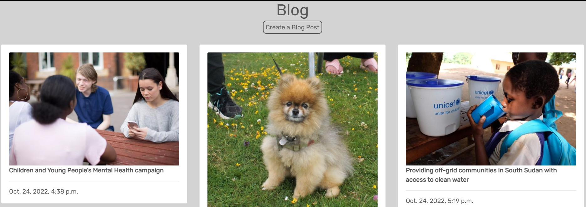
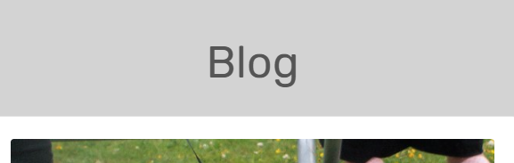

# Laneys Loft

Laneys loft is a charity ecommerse site.  It takes donations of clothes books and kids toys and the items online.  It then donates proceeds to charities and charitable events. 

You can reach the live site [here]()

# Table of contents   

<small><i><a href='http://ecotrust-canada.github.io/markdown-toc/'>Table of contents generated with markdown-toc</a></i></small>

# User-Experience-Design

## Site Goals

The site is aimed at anyone that wants to donate their unwanted items to charity, and anyone who wants to buy preloved items  Without signing in the user can browse the online store and donate their items.  they can also look at the site blog to see where they money is being spent.  They can log in to see a log of the items they have bought and leave a review of the site.  They can also save their details for future purchases.

## Agile Planning

This project was developed using agile methodologies, delivering small features over 5 sprints spaced out over 6 weeks.  Each issue was labelled must have, should have and could have.  The must have features were completed first, then the should have's, then the could have's.  It was done this way to ensure a complete website is made with the nice to have features added if there is capacity.

My kanban board was made using github projects which can be viewed [here]().  Each view can be clicked in to obtain further information.

The user stories were grouped into different Epics

Epic 1 - Set up

The base setup of the Django app was done first as nothing else can be completed before this is done. I completed the base html, and the header. 

Epic 1 user stories

- As a developer, I need to set up the project so that it is ready for implementing core features
- As a developer, I want to create a base HTML page so that all pages can use the same format.
- As a user, I want to be able to navigate easily around the site easily from any device

Epic 2 - Products and shopping bag

Setting up database model and admin functions and template pages to be able to view the products available to buy and have messages confirming when items have been added to the bag.

Epic 2 User Stories

- As a shopper, I want to view a list of products so that I can select something to buy
- As a shopper, I want to be able to click into a product to view its details so I can see what size it is etc
- As a user I want to be able to view what I have added to my shopping bag and the total price
- As a user I want to be able to delete items from my bag when I decide I no longer want something.
- As a user I want to receive a confirmation when I have made changes ie, adding and removing items to my bag so that I know when a change has been completed.

Epic 3 - payment and purchase confirmation emails.

Epic 3 User Stories

- As a shopper I want to be able to easily enter my payment details so that I can purchase my chosen items easily.
- As a shopper I want to see confirmation that my payment has gone through successfully and that my purchase is being sent to the correct address so that I know it has been done correctly
- As a shopper I want laneys loft to send me an email so that I can keep confirmation of purchase for my own records.

Epic 4 Allauth
User Stories
- As a new user, I want to be able to sign up easily and intuitively
- As a returning user, I want to be able to log in easily.
- As a user, I want to be able to log out of the site safely and easily.
- As a developer, I want to ensure the forms are all the same style and look good on all devices

Epic 5 - Profile Page
 - As a user I want to be able to access a profile page so that I can update my orders
 - As a usder I want to see what donations I have made in the past
 - As a user I want to be able to update my details if I move house.

Epic 6 - Blog

- As a site user I want to be able to see where the money from the site is being sent so I can feel good about my purchases
- As a site owner I want to easily be able to add blog entries onto the Site
- As a site owner I want to be able to edit my blog posts so that I can make corrections easily
- As a site owner I want to be able to delete blog posts as necessary.
- As a site owner I want to be the only one who can create edit and delete blog posts

Epic 7 - Reviews

Epic 7 User Stories

- As a user I would like to be able to read reviews about so I can decide if I want to use it
- As a site user who is logged in I would like to be able to leave my own review so that I can tell others about my experience
- As a user it would be nice to give my review a rating out of five for ease of reference
- As a site owner it would be nice to be able to reply to reviews to show a personal touch

Epic 8 Donations

- As a user I want to be able to arrange for my donated items to be picked up easily.

Epic 9 Footer

Epic 9 User Stories

- As site owner, I want to share social media links and contact details
- As site owner I want a nav bar for the site extras such as the blog, reviews and subsribe pages

Epic 10 - Documentation and styling

Epic 10 Tasks

- Complete Styling on all pages and all screen sizes
- Complete Readme documentation
- Complete testing and writeup

## Scope
- Responsive Design
- Home page with information about Laneys Loft
- Ability to perform CRUD functionality on the Blog
- Restricted features for not logged in as users and superusers

## Structure

### Laneys Loft Features

Navbar

user story - As a user I want to be able to navigate easily around the site easily from any devise

Navigation Menu

from the main top navigation bar the user can log in or sign in.  Once logged in they can access their profile page.
They can browse all the site products and check their shopping bag.  They can also search the site using the search bar.

The superuser can also view the Product Management section to manage the store items.

on mobile devices they shopping navigation collapses into a dropdown square and the search bar drops down to a magnifie glass search icon

### Home Page

- User Story - As a user I want the front page to be clear and self-explanatory so I know I am in the right place

The front page contains an image of a charity shop.  This gives the initial impression of pre loved goods.

The front page also containes a tag line advising the user they can shop or donate with a button to take them to either place on the website.  This gives an imediate idea of what the website is for.

Under this is information about the site and how to shop or donate.

### Footer

- User Story: As site owner, I want to share social media links and contact details
- User Story : As site owner I want a nav bar for the site extras such as the blog, reviews and subsribe pages

The Footer has been added to the bottom of the site and contains links the sites blog, reviews and donations form.  Users can also subscribe the sites news letter from here.

underneath the footer navigation bar users can see the contact email for the site and links to the social media pages.

### Browse Items

- User Story: As a shopper, I want to view a list of products so that I can select something to buy

Users can easily brows items to buy, products come up in rows of 4 on the larges screen and they reduce down to 3,2 then 1 depending on screen size. 

Users can also search by womens, mens and kids items. They can also pick from a dropdown list of different clothing types to refine their search further.

Users can also search by price.  They can also search for specific words in the search bar at the top of the page

### Item Detail 

- As a shopper, I want to be able to click into a product to view its details so I can see what size it is etc

Users can select see more detail about an item by clicking on the picture.  This takes them to a detail page where they can then add it to their basked if they wish

### Sign in, log in, log out

- As a new user, I want to be able to sign up easily and intuitively
- As a returning user, I want to be able to log in easily.
- As a user, I want to be able to log out of the site safely and easily.
- As a developer, I want to ensure the forms are all the same style and look good on all devices

  

The sign in, log in, log out pages were made using allauth.
They all have a white background with round corner buttons and input boxes.
They all have greay writing.  This crates continuity within the authorisation section of the site.  I have made them on a white background rather than gray so that they are slightly different from the other ones on the site but they still keep the font style for the title to connect them with the test of the site.

The user will receive a toast message saying they have successfully signed in and out.

 

### Shopping Bag

User Stories
- As a user I want to be able to view what I have added to my shopping bag and the total price
- As a user I want to be able to delete items from my bag when I decide I no longer want something.
- As a user I want to receive a confirmation when I have made changes ie, adding and removing items to my bag so that I know when a change has been completed.

The shopping bag shows a picture of the itme(s) in the bag along with the item name, price, quantity (although it is only ever one because there is only one of each item) and the price.  There is also a delete button so items can be deleted easily.

When items are added or deleted from the basked a success message appears that contains the bag content and a link to the checkout page.

 

### Checkout Page

User Stories
- As a shopper I want to be able to easily enter my payment details so that I can purchase my chosen items easily.

The checkout page has an easy to complete form that takes the users name, address and card details. It also has a summary of the purchase to confirm what is being bought.

It also has a tickbox to save the details to the profile page so it will be prefilled the next time they buy something.

Dispite the rest of the boxes on the site having rounded edges, I decided to keep the checkout boxes with sharp edges.  This is because it feels like a more important/trustworthy shape for an important transaction.

### Order Confirmation 

- As a shopper I want to see confirmation that my payment has gone through successfully and that my purchase is being sent to the correct address so that I know it has been done correctly
- As a shopper I want laneys loft to send me an email so that I can keep confirmation of purchase for my own records.

Once the order has been processed a confirmation page tells the user the order details.  It also advises an email has been sent to the email address provided.

### Profile Page

 - As a user I want to be able to access a profile page so that I can update my orders
 - As a user I want to be able to update my details if I move house.

The profile page has the users address details available to edit if necessary.  It also has a record of all of past shopping orders.

### Blog
User stories:
- As a site user I want to be able to see where the money from the site is being sent so I can feel good about my purchases
- As a site owner I want to easily be able to add blog entries onto the Site
- As a site owner I want to be able to edit my blog posts so that I can make corrections easily
- As a site owner I want to be able to delete blog posts as necessary.
- As a site owner I want to be the only one who can create edit and delete blog posts

The blog page shows a list of blog posts that have been entered by the site owner. 

The create a blog post button is only visible to the superuser

## Features left to impliment

There were a few items that would have been really nice to include, that I included in my user stories but unfortunately I ran out of time.
- I wanted to add the donation details to the profile page as well as the orders so that user could have a record of this as well. 
- I wanted to add a star rating system to the reviews page. This would have been a nice extra visual to see what people though of the site.
- I wanted to add replies to the reviews page so that the site owner could reply to customers and solve problems they have, this would add extra user experience value and would deffinately be in the next update if there was one.

# Wireframes

Home Page

Sign Up

Log In

Log out

Browse Ideas

Idea Detail

Create/Edit Idea Form

Delete Idea Conirmation

# Database

The data was designed to give the user CRUD functionality once signed in.  Ideas are connected to the author by foreign key which allows users to edit and delete ideas connected to their account. 

# Security

Views were secured by using the django based view mixin, UserPassesTestMixin.  A test function was created to use the mixin and checks that the user is authorised to access the page.  an if statement is also used in idea_detail.html to hide the delete and edit buttons if the user is not authorised.  

Environment variables were stored in an env.py file for security purposes to ensure no secret keys, api keys or sensitive information were added to the repository.  These variables were added to heroku config vars within the project

# Design

## Colour Scheme

I opted for a simple colour scheme.  It needed to be gender neutral and although the site is about children it is aimed at adults so I wanted a more adult feel to it.  I also wanted it to be neutral so that the user ides stood out.  with this in mind, I went for a background colour of #041121

and a text colour of rgb(237, 233, 249.

## Typogropny

I used Yusei Magic for the body of the site and Ranchers for the Kidsbored heading.

I downloaded these from google fonts and imported them into the style sheet

## Imagery  

The hero image used is a picture of my own.  I sought permission from the parents of the children.

The placeholder image was taken from pexels and is royalty free.  I chose a generic picture of children running through a field.  It is bright and colourful.

# Technologies

- HTML
  - The structure of the site was made using HTML
- CSS
  - The website was styled using CSS in an external stylesheet 
- Python 
  - Python was the main programming language used within the django app
- Github
  - Source code was hosted in Github
- Git
  - Git was used to write, commit and push code during development 
- Font Awesome
  - Various Font Awesome icons were used throughout the site
- Balsamiq
  - Balsamiq wireframes were used to plan 
- javascript
  - I used a very small amount of javascript to make the toast messages disappear
- [GitHub Wiki TOC generator](http://ecotrust-canada.github.io/markdown-toc/)
  - I used this to enter my table of contents.

## External Python Modules
- cloudinary==1.29.0 - cloudinary was used to store imagery for the site and to upload user images
- dj-database-url==0.5.0 - used to parse database url for production environment
- dj3-cloudinary-storage==0.0.6 - Storage system for cloudinary
- Django==3.2.13 - Framework used to build the application
- django-allauth==0.51.0 - Used for the sites sign in and sign out authentication system 
- django-cloudinary-storage==0.3.0 - Storage for cloudinary
- django-crispy-forms==1.14.0 - used to style forms 
- django-summernote==0.8.20.0 - used in admin panel
- gunicorn==20.1.0 - Installed as a dependency with another package
- oauthlib==3.2.0 - Installed as a dependency with another package
- Pillow==9.2.0 - Installed to upload images but ended up using cloudinary istead,  left incase needed for future development
- psycopg2==2.9.3 Needed for heroku deployment 
- whitenoise==6.2.0 - Installed to deploy static files to heroku.

# Testing

## Functional Testing

### Navigation Links

Testing was performed on on all navigation links throughout the site.  I achieved this by clicking on each link to ensure it went to the correct place.

kidsbored Logo => index.html
Home page => index.html
Browse Ideas => ideas.html
Idea Title => ideas_detail.html
Delete Button => idea_delete.html
Edit Button => idea_edit_form.html
Edit Button Submit Button => ideas.html
Activity Website => chosen website(opens in new tab)
Register => signup.html
Add Idea = > create_idea.html
Add Idea Submit Button => ideas.html
Log In => login.html
Log Out => logout.html

All navigation links worked as expected

### Footer

All the font awesome icons in the footer opened to their respective websites, in a new window, as expected.

### Sign Up Page

Testing was taken out to ensure a user could sign up to the website.
Steps:
- Navigate to [Kidsbored](https://kids-bored.herokuapp.com/)
- Navigate to the Register page
- Enter User Name and Password, email is optional
- Click Sign Up

Expected outcome: User is redirected to the home page.  The Navbar changed to show the create Idea potion and log out option.
Actual outcome: User is redirected to the home page.  The Navbar changed to show the create Idea potion and log out option.

### Log out Page

Testing was taken out to ensure a user could log out of the website.
Steps:
- Navigate to Log Out page
- Click Confirm button

Expected outcome: User is taken back to the homepage with the Create Idea option hidden and the Register option showing.
Actual outcome: User is taken back to the homepage with the Create Idea option hidden and the Register option showing.

### Log in

Testing was taken out to ensure a user could log in to the website.
Steps:
- Navigate to [Kidsbored](https://kids-bored.herokuapp.com/)
- Navigate to Log In page
- Enter User Name and Password
- Click Sign in

Expected outcome: User is redirected to the home page.  The Navbar changes to show the create idea option and log out options. A message appears to say they have successfully logged in.
Actual outcome: User is redirected to the home page.  The Navbar changed to show the create Idea potion and log out option. A message appears to say they have successfully logged in.

### Create Idea Page

Testing was taken out to ensure the user could create a new idea.

Assuming user is already logged in
Steps:
- Navigate to Add Idea page
- Complete form
  - Activity Name
  - Upload Image (optional)
  - Activity Location
  - Age Range
  - Price
  - Activity Website(optional)
  - Review (optional)
- Click Submit

  Expected Outcome if all fields are filled in correctly the user will be redirected to the Brows Ideas page where they can view their idea.  A message appears to say they have successfully created their idea.

  Expected outcome if the fields are not filled in correctly: A nocies to complete the field appears and the cursor goes to the field that needs to be completed.

  Both of these outcomes happened correctly when tested.

### Edit Idea

Tested to ensure the user could edit their idea.

Assuming the user is logged in
Steps:
- Navigate to the browse ideas page
- Click on the Activity Name
- If the user is the Author of the activity, they will see a delete button and an Edit button under the Activity Name
- Click the edit button
- Update the fields you wish to update
- Click Submit

Expected outcome:  The user will be redirected back to the browse ideas page which will show the new information, and a message appears to say they have succesfully updated their idea.

The outcome was as expected.

### Delete a post

Tested to ensure a user could delete their idea.

Assuming the user is logged in
Steps:
- Navigate to the browse ideas page
- Click on the Activity Name
- If the user is the Author of the activity, they will see a delete button and an Edit button under the Activity Name
- Click the delete button
- User is taken to a Delete confirmation page asking them if their wish to delete that idea showing the activity name.
- Click Submit

Expected outcome:  The user will be redirected back to the browse ideas page and the idea along with the comments will be deleted.

The outcome was as expected.

### Comment on a post

First I checked the comment section when the user is Logged out.
As expected there is no option to enter a comment at all.  You can view other people’s comments but the box to write your own comment is hidden.

If the user is logged in:
Steps
- Navigate to Browse Ideas
- Click on the activity name
- scroll down to the comments section.
- Write your comment in the comments box
- Click submit

Expected outcome: The comment will appear in the comment section to the left of the comment box.

The outcome was as expected.

### User test

I asked my brother to use the site, upload an idea and give me feedback.  He found the site easy to use but found a problem, when he uploaded his picture it cut his daughters head off.  She was most upset about this.  This highlighted a bug which I have written about in the bug section.

## Accessibility

I used the [Wave Accessibility](https://wave.webaim.org/)tool to check for aid accessibility testing.

All pages came up with zero errors.

They are showing Alerts that show redundant links, on the home page the site logo and the home link on the nav bar are the same.

I have chosen to leave these links as they are because I think they make navigation around the site better.

## Validator Testing

All pages were run through the [w3 HTML validator](https://validator.w3.org/).  Initially, there were some errors, for example there were some missing closing tags and a 
 tag that was used incorrectly inside a .  

All issues were fixed and all pages ran through the checker with no errors.

Due to the use of django language within the HTML files to complete this check I had to retrieve the html code from the open web page and right-click to view the source code.  I could then copy and paste this into the validator.

## PP8 Validator

All pages were run through the [PEP8 Validator  ](http://pep8online.com/).  There were some errors, for example, lines to long and whitespace. All issues were corrected and all pages apart from the settings.py page have passed.  The settings file contains code that is not mine so I did not change it.

I didn't use any javascript in my project so there was nothing to test here.

## Lighthouse Report

The lighthouse report initially showed a low score on performance.  I compressed my hero image which fixed the problem.  

# Responsiveness

I checked the website for responsiveness on all devices from 320px and up.  I checked on Chrome, Edge, Firefox and Opera browers.

I did this by using developer tools and resising the website to down to 320px.

As expected there were no responsiveness issues.

# Bugs

Error when migration change in checkout model.
File "/workspace/.pip-modules/lib/python3.8/site-packages/django/db/backends/dummy/base.py", line 20, in complain
    raise ImproperlyConfigured("settings.DATABASES is improperly configured. "
django.core.exceptions.ImproperlyConfigured: settings.DATABASES is improperly configured. Please supply the ENGINE value. Check settings documentation for more details.

I looked at the error and went to the database section in settings.  I found a typo in Databases and updated this to fix the problem

# Deployment

To deploy my site to Heroku I followed the following steps

- Navigate to heroku and create/log into account
- Click the new button in the top right corner
- Select create new app
- Enter app name (kids-bored)
- Select region and click create app (europe)
- Click the resources tab and search for Heroku Postgres
- Select hobby dev and continue
- Go to the settings tab and then click reveal config vars
- Add the following config vars:
  - SECRET_KEY: (Your secret key)
  - DATABASE_URL: (This should already exist with add on of postgres)
  - EMAIL_HOST_USER: (email address)
  - EMAIL_HOST_PASS: (email app password)
  - CLOUNDINARY_URL: (cloudinary api url)
- Click the deploy tab
- Scroll down to Connect to GitHub and sign in / authorize when prompted
- In the search box, find the repository you want to deploy and click connect
- Scroll down to Manual deploy and choose the main branch
- Click Deploy

The app should now be deployed

# References
- I used a couple of other peoples projects to reference kanbans and ideas on what code I could google.
  - https://github.com/Gareth-McGirr/Portfolio-Project-4-SizzleAndSteak
  - https://github.com/MattBCoding/pp4-the-pantry
- I also followed the Code Institute Blog walkthrough to start my project off.
- I used the django documentation 
- I used the summernote documentation
- I used the bootstrap documentation

# Acknowledgements

I want to thank:
- My mentor Daisy McGirr for all her guidance
- Chris, Kat, Danny and Katy for letting me use a photo of their children
- My brother for testing my site for me.
- The wonderful slack community
- My husband for putting up with my stress

